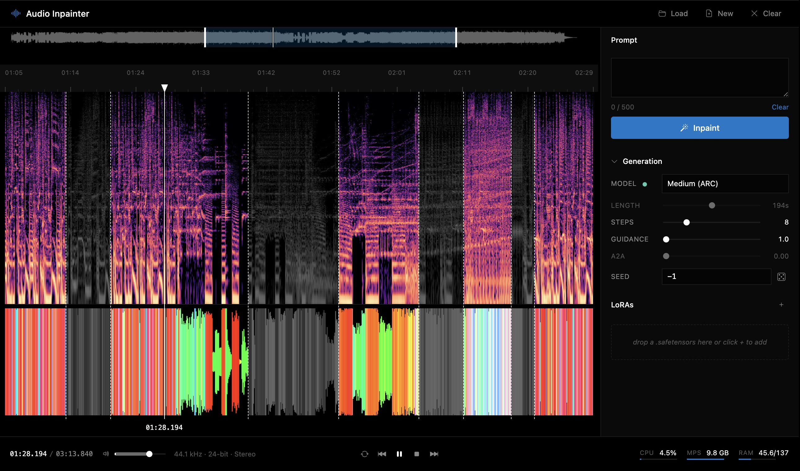

# sa3-inpainter-ui

Browser UI for [Stable Audio 3](https://github.com/Stability-AI/stable-audio-3) — inpainting, vary, text-to-audio, LoRA training, and inference speedups. Runs on CUDA (Linux/WSL) and Apple Silicon (MPS + MLX decoder).



Upstream: [Stability-AI/stable-audio-3](https://github.com/Stability-AI/stable-audio-3) · [stabilityai/stable-audio-3-medium on HF](https://huggingface.co/stabilityai/stable-audio-3-medium)

### Features

- **Inpainting** — paint directly on the spectrogram to select regions, then regenerate with a text prompt
- **Text-to-audio** — generate up to 380s of audio from a prompt
- **Audio-to-audio** — vary existing audio with controllable strength
- **LoRA training** — train LoRAs from the UI with auto batch sizing, pre-encoded latents, and torch.compile support. Model auto-unloads during training to fit in 24GB VRAM. Native MLX training on Apple Silicon
- **LoRA inference** — stack multiple LoRAs with per-LoRA strength sliders and trigger words
- **Textual inversion** — train and apply custom text embeddings
- **Multi-model** — switch between medium, medium-base, small-music, small-sfx. Auto-downloads from HF
- **Inference speedups** — KV cache, token merging (ToME), exit layer early-out, RES4LYF exponential RK samplers
- **Advanced controls** — CFG interval, APG scale, distribution shift, scale phi, memory token strength
- **VAE decode quality** — FP32 decode toggle, configurable overlap for chunked decoding
- **Precision** — runtime FP16/FP32 switching
- **Waveform** — per-latent frequency-colored waveform with ghost overlay for past inpaints
- **Interaction** — scroll zoom anchored at cursor, shift-scroll pan, click-to-scrub playhead, lowpass + duck on playback over masked regions
- **Settings** — configurable paths (models, LoRAs, embeddings, SA3 root, HF token) via gear icon. First-run setup prompts automatically
- **System stats** — live CPU, GPU VRAM, and RAM usage in the bottom bar
- **BPM** — auto-detection and tempo change
- **Keyboard shortcuts** — `?` to view all shortcuts
- **Undo/redo** — full history for mask and audio changes
- **Export** — save/download current audio

### Doesn't have

Per-region prompts · streaming per-step diffusion previews · multi-track · MIDI · frequency-bounded selections · mobile/touch layout · auth · cloud

## Install

Requires Python 3.11+ and Node.js.

```bash
# clone with SA3 as a dependency
git clone https://github.com/xk44/sa3-inpainter-ui.git
cd sa3-inpainter-ui

# python deps
uv sync

# for LoRA training (optional)
uv pip install pytorch_lightning==2.5.5 dill wandb

# frontend deps
cd webui && npm install && cd ..
```

SA3 model weights are gated — accept the license at [HuggingFace](https://huggingface.co/stabilityai/stable-audio-3-medium), then either:

- Set your HF token in the Settings modal (gear icon) and models auto-download on first use
- Or manually: `huggingface-cli download stabilityai/stable-audio-3-medium --local-dir ~/sa3-inpainter/models/stable-audio-3-medium`

For LoRA training, you also need the [stable-audio-3 source repo](https://github.com/Stability-AI/stable-audio-3) cloned locally — set the path in Settings.

## Run

```bash
# backend on :5174 — ~30s to load the model
uv run python backend/server.py

# frontend on :5173 — Vite proxies /api → :5174
cd webui && npm run dev
```

Open http://localhost:5173. On first launch, the Settings modal opens automatically so you can configure paths.

## Configuration

All paths are configurable from the **Settings** modal (gear icon in the bottom bar):

| Setting                 | Default                         | Description                                             |
| ----------------------- | ------------------------------- | ------------------------------------------------------- |
| Models directory        | `~/sa3-inpainter/models`        | SA3 model weights                                       |
| LoRA directory          | `~/sa3-inpainter/loras`         | Trained LoRA files                                      |
| LoRA training directory | `~/sa3-inpainter/lora_training` | Training working directory                              |
| Embeddings directory    | `~/sa3-inpainter/embeddings`    | Textual inversion embeddings                            |
| SA3 source root         | _(empty)_                       | Path to stable-audio-3 repo clone (needed for training) |
| HuggingFace token       | _(empty)_                       | For gated model downloads and training                  |

Settings can also be set via environment variables: `SA3_MODELS_DIR`, `SA3_LORA_DIR`, `SA3_LORA_TRAIN_DIR`, `SA3_EMBED_DIR`. Settings are saved to `~/.config/sa3-inpainter/settings.json`.

---

## Architecture

```
backend/server.py               FastAPI app, model lifecycle, inference, all /api routes
backend/train_lora.py            LoRA training subprocess wrapper
backend/train_lora_compiled.py   torch.compile monkey-patch for training
backend/pre_encode.py            Pre-encode audio to latents for faster training
backend/train_embedding.py       Textual inversion training
backend/kv_cache.py              Cross-attention KV cache for inference speedup
backend/tome.py                  Token merging (ToME) for inference speedup
mlx_sa3/ae.py                   MLX AE decoder (Apple Silicon)
mlx_sa3/nn_blocks.py            Transformer + differential attention + band-mask SWA
mlx_sa3/weights.py              Safetensors to MLX weight remap
mlx_sa3/lora.py                 MLX LoRA adapter injection + weight save/load
mlx_sa3/train_lora_mlx.py       MLX LoRA training loop (Apple Silicon)
mlx_sa3/pre_encode_mlx.py       MLX audio-to-latent pre-encoding
webui/src/lib/session.svelte.js  Shared reactive state + API client
webui/src/lib/MainCanvas.svelte  Spectrogram + paint + zoom interaction
webui/src/lib/RightRail.svelte   Right sidebar: prompt, generation, LoRA, training, advanced
webui/src/lib/BottomBar.svelte   Transport, settings, system stats
webui/src/App.svelte             Layout + audio graph + playback wiring
```
